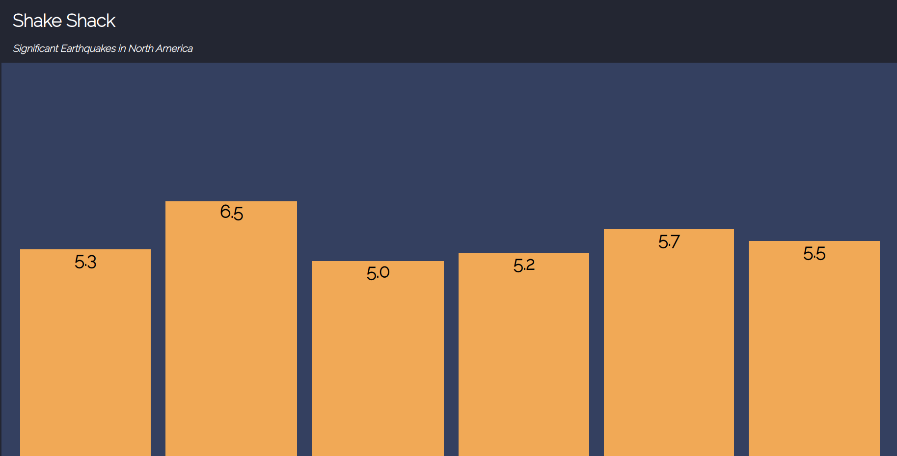

# shake-shack

A CSS visualization of earthquake data from [USGS Earthquake Catalog API](https://earthquake.usgs.gov/fdsnws/event/1/)

## Parameters
The following parameters were used to retrieve the displayed data:

`starttime`: 2020-01-01

`endtime`: 2020-05-07

`minmagnitude`: 5

`minlatitude`: 24.396308

`minlongitude`: -124.848974

`maxlatitude`: 49.384358

`maxlongitude`: -66.885444

Follow [this link](https://earthquake.usgs.gov/fdsnws/event/1/query?format=geojson&starttime=2020-01-01&endtime=2020-05-07&minmagnitude=5&minlatitude=24.396308&minlongitude=-124.848974&maxlatitude=49.384358&maxlongitude=-66.885444) to view the queried data.

# shake-shack-js
